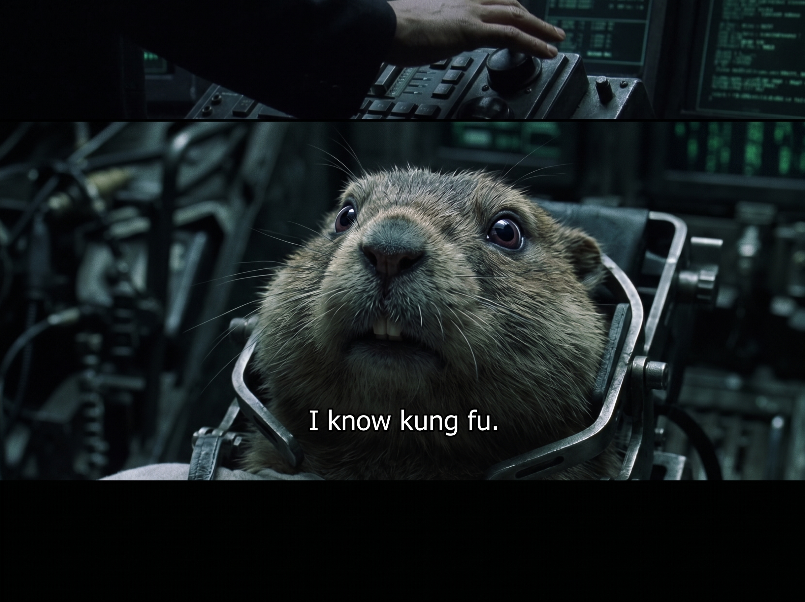

# Gopher Kung-Fu

<p align="center">
  
</p>

Local factory for **true** niche coding SLMs. Each specialist is its own fine-tune and GGUF, not a system prompt. One Go farm hosts them. An external LLM (Kimi, Claude, Cursor, …) plans; the cartridge implements.

```http
POST http://127.0.0.1:8080/v1/chat/completions
{"model":"gopher-kungfu","max_tokens":6144,"messages":[{"role":"user","content":"fix this deadlock"}]}
```

`GET /v1/models` is the roster.

Shipped cartridge: **gopher-kungfu** (Qwen3 1.7B, Q4_K_M) — Go, gin, SQL, concurrency, code review. Do **not** put that id in the agent model slot. Keep a capable model as the agent; call the farm through MCP or a raw POST.

## What v1 does

1. Browser library (`+ SLM`) — name a specialist, pick Qwen3 1.7B or Ministral 3B, pick a teacher
2. Topic catalog + custom tags
3. Teacher writes a syllabus. **Items per topic** is 4–80 (default **12**). Distill uses whatever is in that table
4. Teacher writes synthetic ShareGPT JSONL. Human = short spec; assistant = complete fenced files. Write/debug rows that are mostly prose are dropped
5. Examples land in this project's `synthetic/` **and** a reusable `data/library/<topic>/` shard (deduped by fingerprint). Later cartridges can reuse Go without re-paying for gin
6. Unsloth QLoRA (seq_len default **2048**), then merge + GGUF **Q4_K_M**
7. Farm server: named specialists, LRU load-on-demand
8. MCP (`implement_go`): specialist generates; **the host writes** `.go` files, runs `go test`, retries up to 3 times, returns a **summary**. `ask_gopher_kungfu` is review/debug only

Teacher presets: DeepSeek, Kimi/K2.5, OpenRouter (optional Batch API), OpenAI, or any OpenAI-compatible base URL.

Some teacher APIs restrict training on outputs. That is your responsibility.

## Requirements

**Wizard + distillation** (any OS with Python 3.11+ and Node 20+):

```powershell
python -m venv .venv
.\.venv\Scripts\pip install -e .
cd web
npm install
```

Two terminals:

```powershell
.\.venv\Scripts\python -m uvicorn app.main:app --reload --host 127.0.0.1 --port 8000 --reload-exclude data --reload-exclude unsloth_compiled_cache --reload-exclude .venv --reload-exclude web
cd web
npm run dev
```

Open [http://127.0.0.1:5173](http://127.0.0.1:5173).

**Training** needs an **NVIDIA GPU** and a **CUDA PyTorch** build. `pip install unsloth` on Windows often pulls the CPU wheel (`torch==…+cpu`). Unsloth then fails with "cannot find any torch accelerator".

```powershell
# in this repo's .venv — installs CUDA 13.0 wheels (driver 12.8+ / 13.x)
.\scripts\install_train.ps1
```

Or by hand:

```powershell
.\.venv\Scripts\pip install --upgrade torch torchvision --index-url https://download.pytorch.org/whl/cu130
.\.venv\Scripts\pip install --upgrade unsloth datasets
.\.venv\Scripts\python -c "import torch; print(torch.cuda.is_available(), torch.cuda.get_device_name(0))"
```

RTX 50-series (Blackwell) needs CUDA 12.8+ wheels (`cu128` / `cu130`), not the default CPU or cu124 builds.

VRAM: ~8 GB for Qwen3 1.7B QLoRA; prefer 12 GB+ for Ministral 3B. First train downloads `unsloth/Qwen3-1.7B-unsloth-bnb-4bit`.

**Export** converts the merged HF weights to GGUF **Q4_K_M**. On Windows this downloads official `llama.cpp` CPU binaries (`llama-quantize`) plus `convert_hf_to_gguf.py` — it does **not** compile llama.cpp and does not need CMake. Unsloth's bundled zip hits the Windows 260-character path limit and then wrongly tries `winget install Kitware.CMake` even when CMake is already installed.

You can still point at a local checkout with `LLAMA_CPP_DIR`.

## Farm server

From the repo root (uses `go.work` → `server/go.mod`):

```powershell
go run ./server/cmd/cartridge-server -cartridges ./cartridges -addr 127.0.0.1:8080
```

Or: `go -C server run ./cmd/cartridge-server -cartridges ../cartridges -addr 127.0.0.1:8080`

Needs `llama-server` to actually answer. Listing models works from `card.json` alone.

Resolution order: `--llama-server` / `LLAMA_SERVER`, then `PATH`, then the CPU binary export already dropped at `data/llama_cpp/bin/llama-server.exe` (run from the repo root). Explicit path:

```powershell
go run ./server/cmd/cartridge-server -cartridges ./cartridges -addr 127.0.0.1:8080 -llama-server .\data\llama_cpp\bin\llama-server.exe
```

Context window is `--ctx-size` / `LLAMA_CTX_SIZE` (default **32768**, Qwen3's trained length). Coding clients wrap a one-word prompt in a large system prompt + tool schemas; 4096 is too small for that.

At most `--max-loaded` GGUFs stay in VRAM (default 2). Idle specialists unload (LRU). Restart the farm after changing `--ctx-size` so the already-loaded llama-server is replaced.

## MCP handoff

The specialist is the **implementer**. The big model plans, lists files, and reads the summary. It should **not** paste specialist source into its own write tool.

```powershell
.\.venv\Scripts\pip install -e ".[mcp]"
```

Start the farm, then launch the stdio server with **python.exe directly** — not `cmd /c` and not `scripts/gopher_mcp.cmd`. Batch wrappers break stdin/stdout on Windows, so Kilo thinks the process died and respawns it.

```text
.venv\Scripts\python.exe -u scripts\gopher_mcp.py
```

macOS/Linux: `.venv/bin/python -u scripts/gopher_mcp.py`. Entry point: `gopher-mcp`.

| Tool | Does |
|---|---|
| `implement_go` | Spec + constraints + file list → farm (`max_tokens` 6144) → host writes `.go` (no `..`) → `go test` → up to 3 retries → **summary** |
| `ask_gopher_kungfu` | Review/debug an existing snippet (`max_tokens` 2048) |
| `list_specialists` | Farm `GET /v1/models` |

`implement_go` fields: `spec`, `constraints`, `files` (newline-separated paths), optional `existing_code` (neighboring signatures only), `workspace` (Go module root). Set `apply=false` to inspect raw specialist text. `freeze_tests=true` skips `*_test.go`. One package or a few files per call — not the whole service.

Env: `GOPHER_FARM_URL` (default `http://127.0.0.1:8080/v1/chat/completions`), `GOPHER_FARM_MODEL` (`gopher-kungfu`), `GOPHER_WORKSPACE`.

**Kilo / PyCharm:** keep Kimi (or another capable agent) as the chat model. MCP settings must use a `command` array of `python.exe -u …\scripts\gopher_mcp.py`, not a `.cmd` wrapper. Approve `implement_go` when prompted. Details and the remaining supervisor/allowlist work: **[docs/local-workers.md](docs/local-workers.md)**.

MCP prepends this contract on `implement` calls, then your spec:

````text
You are the Go specialist IMPLEMENTER, not an advisor.
Return production code. Do not give architecture essays, package shopping lists, or sketches.

For each file, use exactly this shape:

### relative/path.go
```go
package ...
```

Rules:
- Complete files only. No TODOs, no "the rest is similar", no omitted functions.
- Honor constraints exactly (allowed modules, CGO, layout, names).
- Do not add dependencies the spec did not allow.
- If tests are requested, include complete `_test.go` files.
- After the files, at most two sentences. No preamble before the first file.
````

Raw farm POSTs must set `max_tokens` themselves (1024 only fits a sketch) or llama-server will stop mid-file. Same caps in Python: `consult(..., mode="implement")` vs `mode="ask"` in `app/farm_consult.py`.

```powershell
curl.exe -sS http://127.0.0.1:8080/v1/chat/completions `
  -H "Content-Type: application/json" `
  --data-binary "@handoff.json"
```

## Layout

```
data/projects/<slug>/                 # project.json, curriculum, runs/
data/projects/<slug>/synthetic/       # train.jsonl, eval.jsonl, inbox.jsonl
data/projects/<slug>/synthetic/topics/  # this-run snapshot per topic
data/library/<topic>/examples.jsonl   # reusable topic shards (deduped across projects)
cartridges/<slug>/                    # GGUF + card.json
```

Hold-out eval is 10%. Distill default is 100 examples per topic (wizard range 8–400).

## Later (not built)

Repo ingest, Docker CUDA, cloud GPUs. Remaining worker pieces (cartridge import allowlist, supervisor `run_job`, compile-gated retrain): [docs/local-workers.md](docs/local-workers.md).
